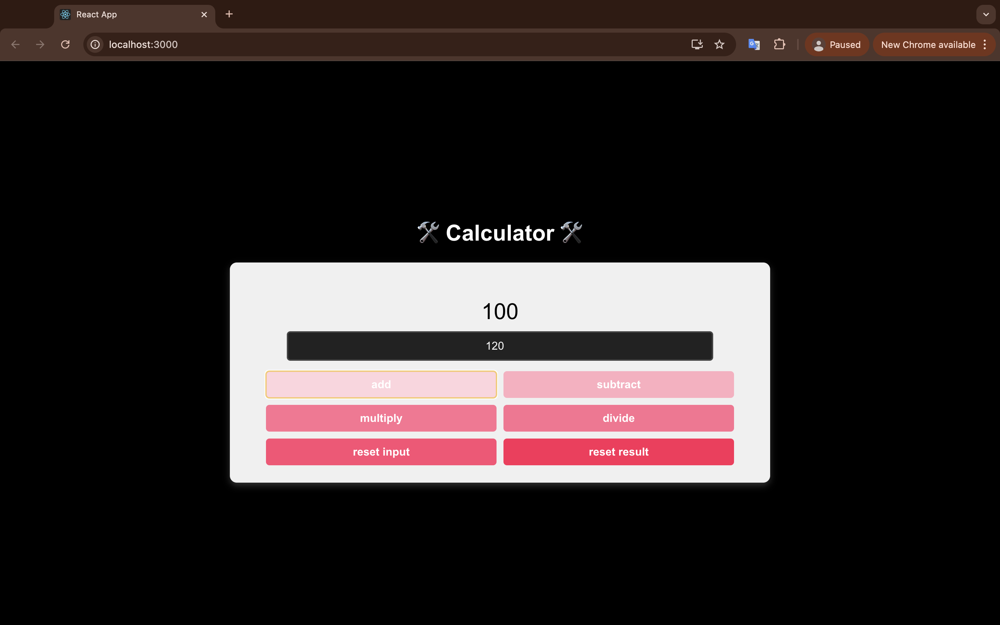

# 🚀 A Simple Project: Calulator using React 🚀

This is a simple calculator built using React. It performs basic arithmetic operations such as addition, subtraction, multiplication, and division. Additionally, you can reset the input field and result with dedicated buttons.

## 🛠️ Features 🛠️
- Add, subtract, multiply, and divide numbers.
- Reset the input field and reset the result to zero.
- Display results in real-time as you perform operations.

## 🌌 Screenshot 🌌

Here’s a screenshot of the app in action:



## 📥 Installation 📥

To get started with this project, follow these steps:

1. Clone this repository:
   ```bash
   git clone https://github.com/YYYEJI/ReactCalculator.git
   cd ReactCalculator

2. Start the app:
    ```
    npm install
    npm start
    ```

The app will be available at http://localhost:3000 in your browser.

## Usage
- Add: Adds the number you enter to the result.
- Subtract: Subtracts the number you enter from the result.
- Multiply: Multiplies the result by the number you enter.
- Divide: Divides the result by the number you enter.
- Reset Input: Resets the number in the input field to zero.
- Reset Result: Resets the calculation result to zero.

## Technologies Used
- React
- JavaScript
- CSS

## 💡 Contributing

We welcome contributions! Feel free to submit a pull request or open an issue for feature requests or bug reports.

